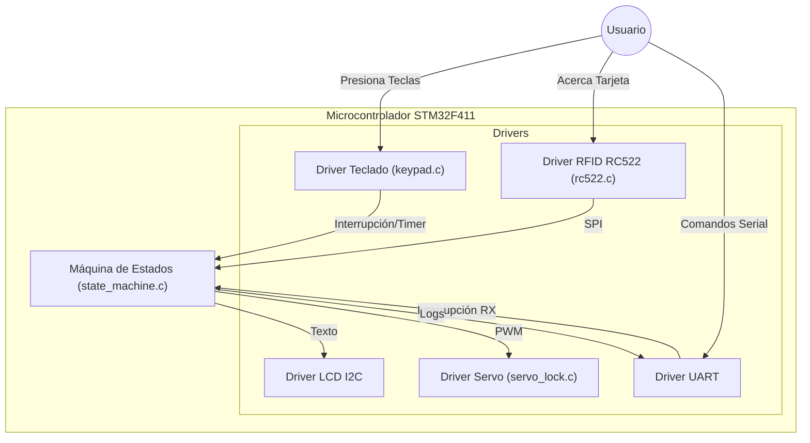
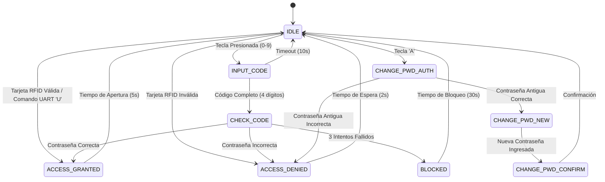

# Documentación del Sistema Smart Lock (Cerradura Inteligente)

Este documento proporciona una explicación detallada del código fuente, la arquitectura del sistema y los componentes de hardware utilizados en el proyecto de Cerradura Inteligente con STM32.

## 1. Arquitectura del Sistema

El sistema se basa en una arquitectura de **Máquina de Estados Finitos (FSM)** que coordina las interacciones entre los periféricos de entrada (Teclado, RFID, UART) y salida (LCD, Servo, UART).

### Diagrama de Componentes

---

## 2. Máquina de Estados (State Machine)

El núcleo del sistema es `state_machine.c`. Controla el flujo lógico para garantizar que la cerradura solo se abra bajo las condiciones correctas.

### Diagrama de Estados

### Descripción de Estados

| Estado | Descripción |
| :--- | :--- |
| **STATE_IDLE** | Estado de reposo. Espera una tecla, una tarjeta RFID o un comando UART. El servo está cerrado. |
| **STATE_INPUT_CODE** | El usuario está ingresando la contraseña dígito a dígito. Tiene un timeout de 10s. |
| **STATE_CHECK_CODE** | Verifica si la contraseña ingresada coincide con la guardada. |
| **STATE_ACCESS_GRANTED** | Abre el servo, muestra "ABIERTO" y espera 5 segundos antes de cerrar automáticamente. |
| **STATE_ACCESS_DENIED** | Muestra "Acceso Denegado" y cuenta los intentos fallidos. |
| **STATE_BLOCKED** | Bloquea el sistema por 30 segundos si hay 3 intentos fallidos consecutivos. Ignora el teclado. |
| **STATE_CHANGE_PWD_*** | Secuencia de estados para cambiar la contraseña (Autenticación -> Nueva Clave -> Confirmación). |

---

## 3. Explicación de Drivers

### 3.1. Teclado Matricial 4x4 (`keypad.c`)
Este driver utiliza una técnica híbrida de **Interrupciones Externas (EXTI)** y **Escaneo por Timer** para ser eficiente y responsivo.

*   **Funcionamiento:**
    1.  **Reposo:** Todas las columnas se ponen en BAJO (Activas). Las filas se configuran como entradas con interrupción (EXTI) en flanco de bajada.
    2.  **Detección:** Cuando se presiona una tecla, se genera una interrupción EXTI en la fila correspondiente.
    3.  **Identificación:** El sistema sabe qué fila generó la interrupción. El Timer (TIM11) está ciclando constantemente las columnas (poniendo una en BAJO y las demás en ALTO) para determinar cuál columna está activa en ese momento exacto.
    4.  **Cruce:** La intersección de la Fila (EXTI) y la Columna actual (Timer) determina la tecla exacta.
    5.  **Debounce:** Se implementa un filtro de tiempo (200ms) para evitar rebotes mecánicos.

### 3.2. Servo Motor (`servo_lock.c`)
Controla el servomotor utilizando **PWM (Modulación por Ancho de Pulso)**.

*   **Timer:** Usa `TIM3` canal 1.
*   **Lógica:**
    *   Un pulso de ~0.5ms a 1ms mueve el servo a 0° (Cerrado).
    *   Un pulso de ~2ms a 2.5ms mueve el servo a 180° (Abierto).
    *   La función `Servo_SetAngle` convierte un ángulo (0-180) en el valor de registro `CCR` del timer.

### 3.3. RFID RC522 (`rc522.c`)
Permite la lectura de tarjetas de proximidad (NFC/RFID) a 13.56 MHz.

*   **Comunicación:** Utiliza el protocolo **SPI** (SPI1) para comunicarse con el módulo RC522.
*   **Proceso de Lectura (`SM_CheckCard`):**
    1.  `Request`: Pregunta si hay alguna tarjeta en el campo.
    2.  `Anticoll`: Si hay tarjeta, lee su Identificador Único (UID) de 4 bytes.
    3.  **Verificación:** Compara el UID leído con un UID autorizado hardcodeado (`DE AD BE EF`).

### 3.4. LCD I2C (`LiquidCrystal_I2C.c`)
Pantalla LCD 20x4 conectada vía I2C para minimizar el uso de pines.

*   **Comunicación:** Usa el periférico I2C1. Envía comandos y datos para controlar el cursor y escribir texto.

---

## 4. Análisis de Mejoras (Gap Analysis)

Para convertir este prototipo en un producto robusto y comercial, se identifican las siguientes áreas de mejora:

### 4.1. Gestión de Credenciales (CRÍTICO)
*   **Persistencia:** Actualmente, la contraseña (`savedPassword`) se guarda en una variable RAM. **Si se apaga la energía, la contraseña vuelve a ser "1234".**
    *   *Solución:* Guardar la contraseña en la memoria **Flash** interna del STM32 o en una **EEPROM** externa para que persista tras reinicios.
*   **Gestión de Tarjetas RFID:** El UID autorizado está "quemado" en el código (`AUTHORIZED_UID`). No se pueden agregar ni quitar tarjetas sin reprogramar el chip.
    *   *Solución:* Crear un "Modo Admin" que permita escanear una tarjeta nueva y guardarla en una lista de tarjetas autorizadas en memoria persistente.

### 4.2. Seguridad
*   **Cifrado:** La comunicación UART es texto plano. Cualquiera conectado a los pines TX/RX puede ver la contraseña o enviar 'U' para abrir.
*   **Sensor de Puerta:** El sistema asume que la puerta se cerró tras 5 segundos. No sabe si realmente está cerrada.
    *   *Mejora:* Agregar un sensor magnético (Reed Switch) para saber si la puerta está físicamente abierta o cerrada y alertar si se dejó abierta.

### 4.3. Funcionalidades Faltantes en Código
*   **Comando 'L' (Lock) en UART:** La función `SM_ProcessUART` tiene el caso `case 'L':` vacío. Debería forzar el cierre del servo o cambiar al estado IDLE inmediatamente.
*   **Watchdog:** Implementar un Watchdog Timer (WWDG/IWDG) para reiniciar el sistema automáticamente si se bloquea por ruido eléctrico o errores de software.
